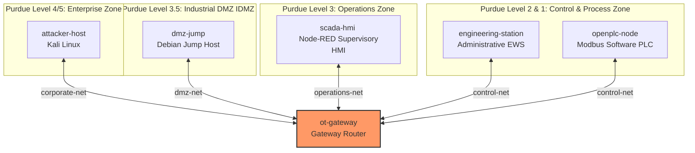

# Operation Waterborne: Industrial Control Hijack and Pivoting (Complex OT Sandbox)

This repository contains the CyberRangeCZ sandbox definition and training scenario
representing a multi-stage cyber intrusion against the **"Resolute" Municipal
Water Treatment Plant**. The scenario simulates state-sponsored threat actors
traversing enterprise, industrial DMZ, and process control networks to perform
industrial sabotage.

The network architecture is structured in accordance with the **Purdue
Enterprise Reference Architecture (PERA)** and adheres to the security zoning
guidelines defined by the **ISA/IEC 62443** standard.

---

## 1. Network Topology and Purdue Model Alignment

The sandbox spans four distinct security zones, isolating administrative
systems, DMZ jump-hosts, supervisory control nodes, and Direct Control (PLC)
processes.



### Sandbox Host Specifications

| Hostname | Purdue Level | Role | Operating System | OpenStack Flavor | Management Network IP | Operational Interface / Subnet |
| --- | --- | --- | --- | --- | --- | --- |
| **`attacker-host`** | Level 4/5 | Adversary Workstation | Kali Linux | `kali` | `192.168.128.141` | `10.10.10.50` (`corporate-net`) |
| **`dmz-jump`** | Level 3.5 | SSH Jump Host | Debian 12 | `standard.small` | `192.168.128.251` | `192.168.50.50` (`dmz-net`) |
| **`scada-hmi`** | Level 3 | Supervisory HMI | Debian 12 | `standard.small` | `192.168.129.238` | `192.168.100.10` (`operations-net`) |
| **`engineering-station`** | Level 2 | Admin Station (EWS) | Debian 12 | `standard.small` | `192.168.128.181` | `192.168.20.20` (`control-net`) |
| **`openplc-node`** | Level 1 | Modbus Software PLC | Debian 12 | `standard.small` | `192.168.129.203` | `192.168.20.10` (`control-net`) |
| **`ot-gateway`** | - | Firewall Router | Debian 12 | `standard.small` | `192.168.128.159` | Routing Gateway Interfaces |

---

## 2. Resource Requirements (Single Sandbox Instance)

- **Virtual Machines:** 6
- **vCPUs:** 9 (4 × 1 Kali + 5 × 1 standard.small)
- **RAM:** ~14.1 GB (14,436 MB total: 1 × 4,196MB + 5 × 2,048MB)
- **Disk Space:** 110 GB (1 × 60GB Kali + 5 × 10GB standard.small)

---

## 3. Training Path Walkthrough

The training scenario consists of 8 chronological milestones:

1. **Foothold (Access):** Access the Kali `attacker-host` terminal and
   initialize the workspace.
2. **IDMZ Access (Exploitation):** Scan the IDMZ subnet (`192.168.50.0/24`)
   using `nmap`, perform a dictionary attack using `hydra` and `passlist.txt`
   against the `operator` SSH user on `dmz-jump`, and pivot.
3. **Reconnaissance (Discovery):** From the compromised `dmz-jump` shell,
   scan the operations subnet (`192.168.100.0/24`) to identify the SCADA HMI
   host and active port.
4. **SCADA HMI Compromise (Exploitation):** Establish a local SSH tunnel
   forward (`ssh -L 1880:<HMI>:1880`) to bypass network boundaries, access
   the Node-RED HMI in the web browser, and execute system commands as `root`.
5. **Credential Access:** Inspect the HMI filesystem to extract engineer
   passwords from credential backups.
6. **Lateral Pivot:** Spawn a reverse shell back to Kali, upgrade to an
   interactive PTY session (`python3 pty`), SSH into `engineering-station`
   (`192.168.20.20`), and identify the active controller.
7. **Sabotage (Impact):** Inject Modbus TCP instructions to holding register
   `0` using the `modbus` CLI to disable a critical water pump. Retrieve the
   flag from EWS safety logs.
8. **Knowledge Assessment:** MCQ/EMI testing on the Purdue Model and
   Industrial Protocols.

---

## 4. How to Deploy to CyberRangeCZ Portal

9. Push all modifications to your remote Git repository:

   ```bash
   git add .
   git commit -m "feat: implement DMZ jump host and updated training"
   git push origin main
   ```

10. In the CyberRangeCZ Portal interface, navigate to **Sandbox Definitions**.
11. Re-import or refresh the definition from your repository. If the portal
    exhibits Git caching, specify the latest commit hash (e.g.,
    `03e91bd3d970...`) inside the **Revision** field to bypass the cache and
    force a new fetch.
12. Go to **Pools**, delete the existing outdated pool instance, and allocate
    a new one.
